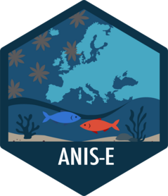

<!-- README.md is generated from README.Rmd. Please edit that file -->
<!-- # anise <a href="https://url"></a> -->

# anise <a href="https://clementviolet.github.io/ANIS-E/"></a>

<!-- badges: start -->

[](https://lifecycle.r-lib.org/articles/stages.html#stable)

<!-- badges: end -->

The goal of `anise` ris to provide an easy access to the data of the
*Atlas of marine Non-Indigenous Species in Europe* (*ANIS-E*) through a
Shiny App or load them directly in the R user environment for further
analysis. **Note**: *ANIS-E* database is a harmonised compilation and
does not aim to independently verify or correct introduction reports
from the original sources; with the exception of native range
assignments and taxonomic harmonisation, all information is reproduced
as reported in the source of the introduction reports.

If you want to contribute to the *ANIS-E* database by submitting new
national listing or native range, please email me:
<clement.violet@umontpellier.fr>. If you’ve found a bug, or wanting to
improve the Shiny app, please feel free to open and issue/pull request.

## Dataset version

The current ANIS-E dataset version, release date, and update type are
documented in [`VERSION.md`](VERSION.md).

## Installation

You can install the development version of anise from
[GitHub](https://github.com/clementviolet/ANIS-E) with:

``` r
# install.packages("devtools")
devtools::install_github("clementviolet/ANIS-E")
```

## Example

### Shiny App

After loading the R package, you can launch the shiny app with:

``` r
library(anise)

shiny_anise()
```

### Loading the datasets

You can also load the different datasets through:

``` r
data_anise()
```

or individual dataset using:

``` r
introduction
meow
origin
pathway
taxonomy
taxonomy_identifiers
```

See the package documentation for the description of the different
datasets and the `vignette("ShinyANIS-E")` for the use of the Shiny app.
