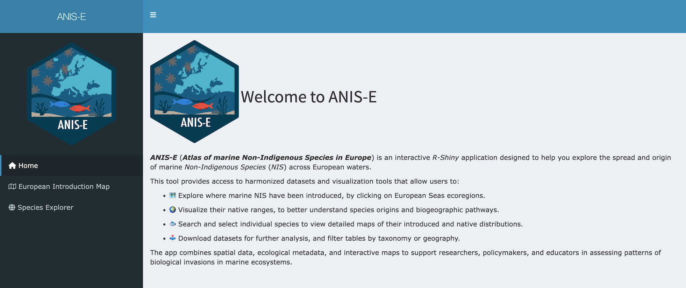
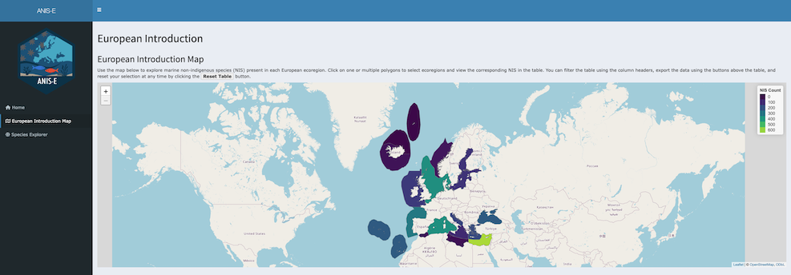
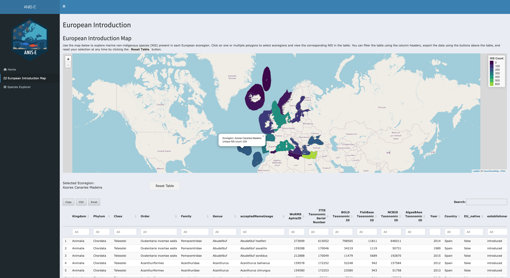
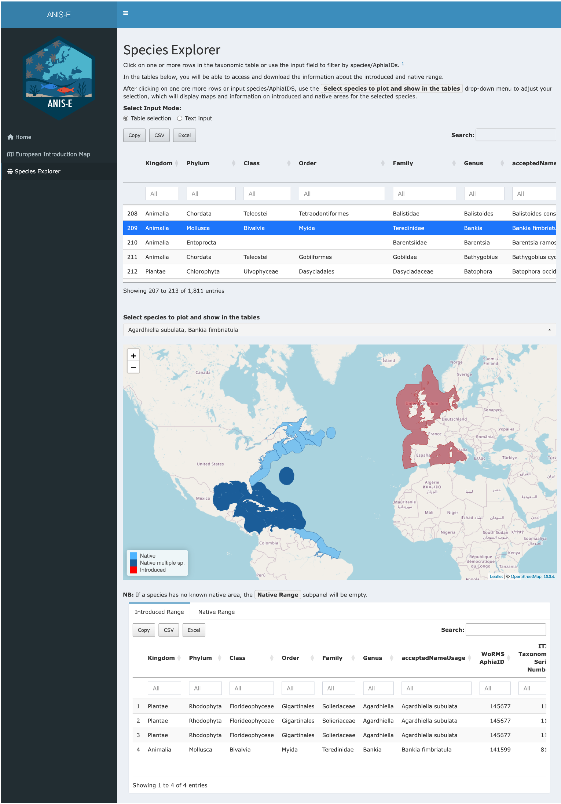
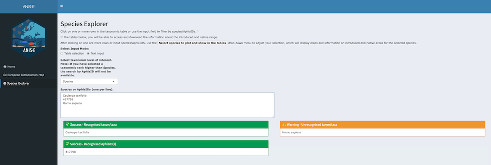
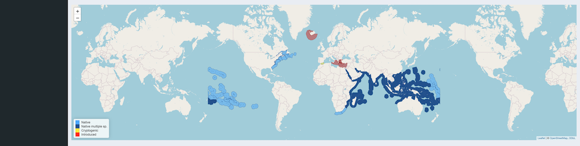
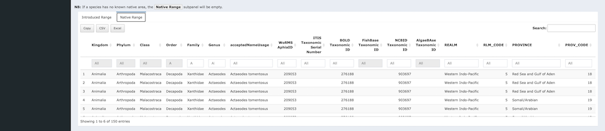

# ANIS-E

## Introduction,

This vignette explains how to use the Shiny application to explore
*Non-Indigenous Species* (*NIS*) in European seas. This vignette will
present you how to launch the app; use the *European Introduction Map*
to inspect regional *NIS* richness and list species; Use the *Species
Explorer* to explore *introduced* and *native* ranges of particular
species and finaly export results

## Quick Start

To launch the app, simply write in the terminal:

``` r
library(anise)

shiny_anise()
```

After launch, the browser shows the `Home page` with a left sidebar for
navigation.



Home page

## Application Overview

The app provides two workspaces:

1.  **European Introduction Map** — regional view: where NIS occur and
    which species are present.
2.  **Species Explorer** — species view: introduced vs native ranges for
    selected taxa.

All data tables support `search`, `filter` (when available), `scroll`,
and `export` (Clipboard / CSV / Excel).

## European Introduction Map (Regional Exploration),

The aim of the `European Introduction Map` is to inspect NIS richness by
MEOW ecoregion and to list the species present in each selected region.



The map is composed of polygons that correspond to MEOW ecoregions (see
[Spalding et al. 2007](https://doi.org/10.1641/B570707) for a
description of this regions). Each polygon is filled with a color that
represents the number of unique NIS recorded in that ecoregion. When you
hover over a region, a tooltip appears showing the ecoregion name and
the corresponding NIS count. You can navigate the map by zooming and
panning with your mouse, trackpad, or the on-screen controls.

To inspect a specific region, simply click on a polygon. The label
“Selected Ecoregion(s)” will update, and the species table located below
the map will refresh automatically to display all species present in the
chosen region. It is also possible to select multiple regions, in which
case the table will aggregate the species across all selected areas. To
clear the selections and return to the default view, use the
`Reset Table` button.



The species table displayed under the map contains several columns: the
taxonomy (from Kindgom down to Species), the *AphiaID* identifier
linking the species to the [World Register of Marine
Species](https://www.marinespecies.org/) database, the year the taxon
was first reported in the area, the *MSFD* subregion, and the associated
Realm, Province, and Ecoregion under the *Marine Ecoregion of the World*
framework. The table also specifies the original source for each record.

## Species Explorer

The purpose of the Species Explorer is to inspect both the introduced
and native ranges of selected species. Users can provide input either by
selecting directly from a taxonomic table or by entering species names
or AphiaIDs through a text box.

In `Table mode`, the process is straightforward: locate the taxonomic
table, click on a row to select a species, and then use the species
drop-down menu to adjust your selection, allowing for multiple species
to be explored at once.



In `Text mode`, the input is given manually. You switch the input to
text, choose a taxonomic level (the default is *Species*, and AphiaIDs
are disabled for broader levels such as Genus or Family[¹](#fn1)), and
paste one entry per line, either a species name or an AphiaID (only
available if the taxonomic level choosen is “Species”). For example:

> Caulerpa taxifolia
>
> 417798
>
> Homo sapiens



The app displays a warning box if any names or IDs are invalid. Once
corrected, the species drop-down menu can be used to finalize the set of
species to be examined.

Once species are selected, the app displays a single interactive map
that overlays both introduced/cryptogenic and native ranges at the same
time. The legend clearly distinguishes between these categories so that
users can interpret the results easily. When multiple species are
selected, overlapping regions are styled distinctly, and if a region
contains both introduced and cryptogenic records, they are shown in a
different color for clarity. Note that the `Native multiple sp.` or
`Introduced multiple sp.` in the map legend indicate that the ecoregions
is the native area of two or more selected NIS, or is the introduced
region of two or more NIS.



Below the maps, two range tables are provided. The *Introduced Range
table* lists all regions where the selected species are introduced or
cryptogenic, while the *Native Range table* lists their native regions.
These tables include powerful functions such as global search, optional
column filters, data export in `Copy` (clipboard), `CSV`, `Excel`
formats, and scroll bars to handle wide or long datasets. Note that if
no data are available for a given category (for example, when no native
polygons are known for a species), the corresponding panel remains
empty.



## Exporting Results

All tables in the application provide `Copy` (copy to clipboard), `CSV`,
and `Excel` export buttons, making it easy to save or share the data
according to your needs.

## Use Cases

The following examples illustrate the main ways to interact with the
application. Each use case outlines a sequence of actions and the
corresponding outputs.

For a regional scan, start by opening the *European Introduction Map*.
Hover over the regions to check the NIS counts, then click on one or
more regions to select them. The species table below the map will update
automatically to show the species recorded in the selected areas. Once
reviewed, the table can be exported in CSV or Excel format for further
analysis.

For a species comparison, go to the *Species Explorer* in `table` mode.
Select one or multiple species from the taxonomic table. Use the map to
see Below the maps, consult the introduced and native range tables, and
export them if needed.

For a batch list query, change the input mode to `text`. Paste a list of
species names/taxonomic level of interest or AphiaIDs, one per line,
into the text box. Any invalid entries will be flagged in a warning box;
correct them and re-run the search if necessary. The Species The
drop-down menu allows you to refine the list of valid species to plot
and show in the table, after which you can explore the maps and range
tables and export the results.

## Tips & Troubleshooting

- **Empty results**: If a panel shows no data, this usually means that
  the species does not have records for that specific category. For
  example, some species may lack native polygons in the database. In
  such cases, check the other panel (Introduced or Native) to see if
  information is available there.

- **Invalid text input**: Errors may occur if species names are
  misspelled or if AphiaIDs are entered incorrectly. Always ensure
  correct spelling, verify AphiaIDs, and check for synonymy using
  [WoRMS](https://www.marinespecies.org/). When invalid entries are
  detected, the app displays a warning box listing the problematic items
  so that you can correct them and re-run the search.

- **Performance**: Large queries with many species may slow down map
  rendering and table updates. To improve responsiveness, start with a
  smaller set of species and gradually increase the number if needed.

- **Reset**: If the interface becomes cluttered or selections are
  confusing, you can reset easily. In the Species Explorer, use the
  `Deselect All` button of the drop-down menu to reset the taxonomic
  table and outputs. In the European Introduction Map, use the
  `Reset Table` button to clear all selected regions.

------------------------------------------------------------------------

1.  Searching by AphiaID is currently supported only at the species
    level. Future versions will extend this feature to all taxonomic
    levels.
