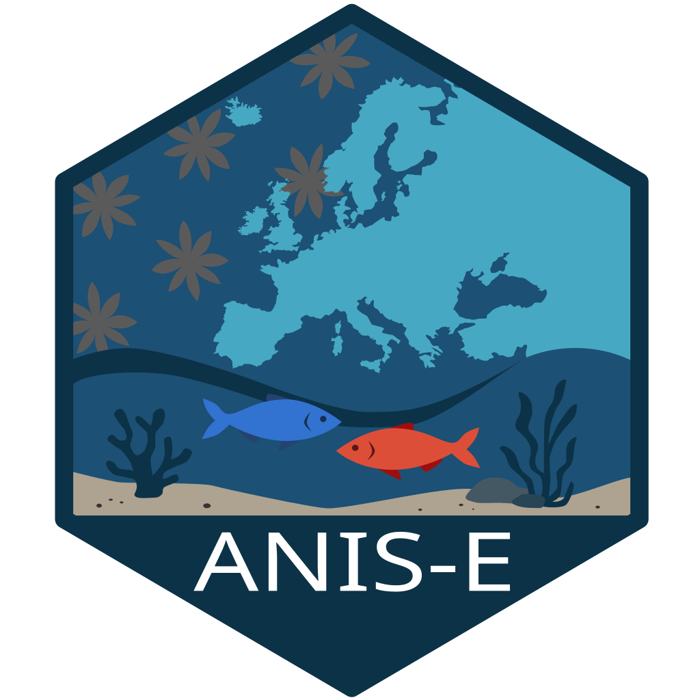

# anise 

The goal of `anise` is to provide an easy access to the data of the
*Atlas of marine Non-Indigenous Species in Europe* through a Shiny App
or load them directly in the R user environment for further analysis.

## Installation

You can install the development version of anise from
[GitHub](https://github.com/) with:

``` r
# install.packages("devtools")
devtools::install_github("xx/xx")
```

## Example

### Shiny App

After loading the R package, you can launch the shiny app with:

``` r
library(anise)

shiny_anise()
```

### Loading the datasets

You can also load the different datasets through:

``` r
data_anise()
```

or individual dataset using:

``` r
taxo_tbl
inv_tbl
origin_tbl
meow
```

See the package documentation for the description of the different
datasets.
